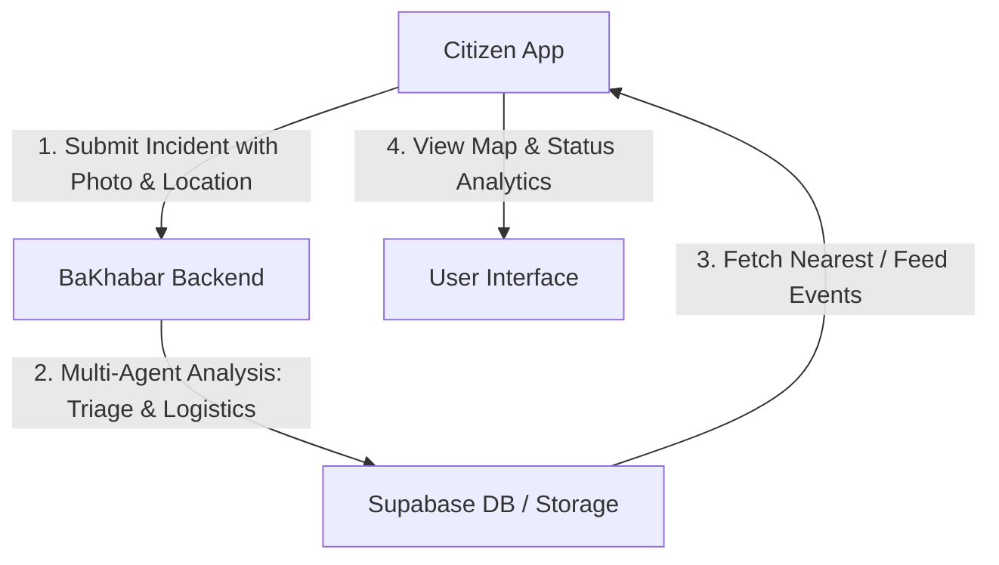

# با خبر (BaKhabar Alerts) — Mobile Client

A real-time, citizen-centric crisis intelligence and response mobile application for instant civilian alerts and localized incident reporting in Pakistan.

---

## 📱 Mobile App Architecture & Flow

The mobile client is the primary interface for citizens to receive alerts and report active hazards. It syncs directly with the **با خبر** multi-agent backend system.



### Key Client Flows:
1. **Onboarding & Auth Flow**: Guides citizens through emergency preparedness goals, followed by secure log in and sign up.
2. **Alerts Consumption Flow**:
   - **Incidents Feed**: Browse alerts filtered by mode (*All*, *Nearby*, or *Priority*) and filtered by severity (*Critical*, *High*, *Medium*, *Low*).
   - **Interactive Map**: Displays hazards on a dark-themed Google Map. Tapping markers opens interactive peek cards.
   - **Status & Analytics**: Renders real-time city-wise monthly trends, priority breakdown, and city-wise distribution of reports.
3. **Citizen Reporting Flow**:
   - Tap **Report** tab -> Capture/pick photo -> Pin location on Map picker -> Write description -> Submit to backend pipeline.

---

## ✨ Features

- **📍 Nearby Incident Detection**: Dynamically calculates and displays incidents closest to the user's GPS coordinates using device location services.
- **🗺️ Interactive Dark Map**: Uses a styled Google Map with custom markers representing active hazards, custom location search, and quick bounds-fitting.
- **📊 Real-time Analytics**: Built-in statistics dashboard displaying stacked area charts and doughnut charts representing nationwide incident metrics.
- **🚨 Direct Crisis Submissions**: Empowering citizens to submit real-time reports with photo attachments and precise coordinate pinning.
- **☁️ Weather & News Enrichment**: Incident detail views display real-time weather alerts (wind speed, rain chance, temperature) and related news articles directly from the area.

---

## 🛠️ Mobile Tech Stack

- **Framework**: [Flutter](https://flutter.dev/) (SDK `^3.10.4`)
- **State Management**: `provider` for structured UI updates.
- **Geospatial & Location**: `google_maps_flutter` and `geolocator` for mapping and nearby computations.
- **Charts & Graphs**: `syncfusion_flutter_charts` for beautiful trend rendering.
- **Networking**: `dio` with custom logging interceptors for API communication.
- **Responsive Layout**: `flutter_screenutil` for pixel-perfect sizing across all devices.

---

## 🚀 Getting Started

### Prerequisites

- Flutter SDK (version `^3.10.4` or higher)
- Android Studio / VS Code / Xcode
- A running emulator or physical mobile device

### Installation

1. **Clone the repository:**
   ```bash
   git clone <repository-url>
   cd google_hackathon_app
   ```

2. **Get packages:**
   ```bash
   flutter pub get
   ```

3. **Configure API Endpoints:**
   API endpoints and the backend URL are configured in `lib/config/api_config.dart`:
   ```dart
   static const String baseUrl = 'https://ciro-backeend-app.netlify.app';
   ```

4. **Run the app:**
   ```bash
   flutter run
   ```

5. **Run tests:**
   ```bash
   flutter test
   ```

---

made with ❤️ using Antigravity
