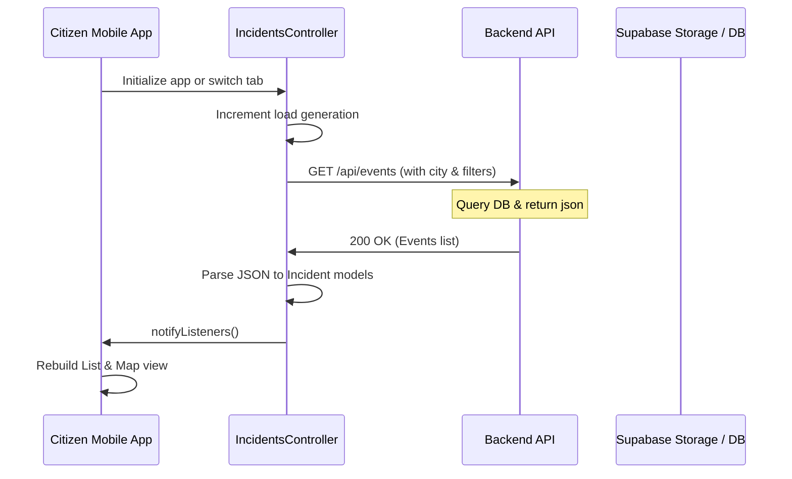
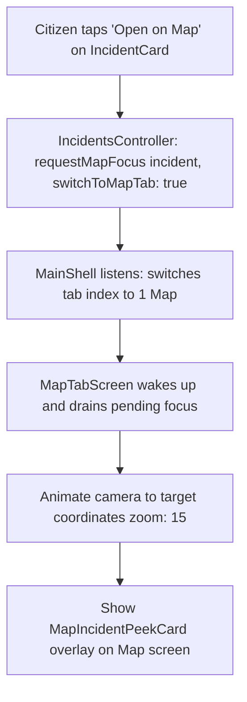
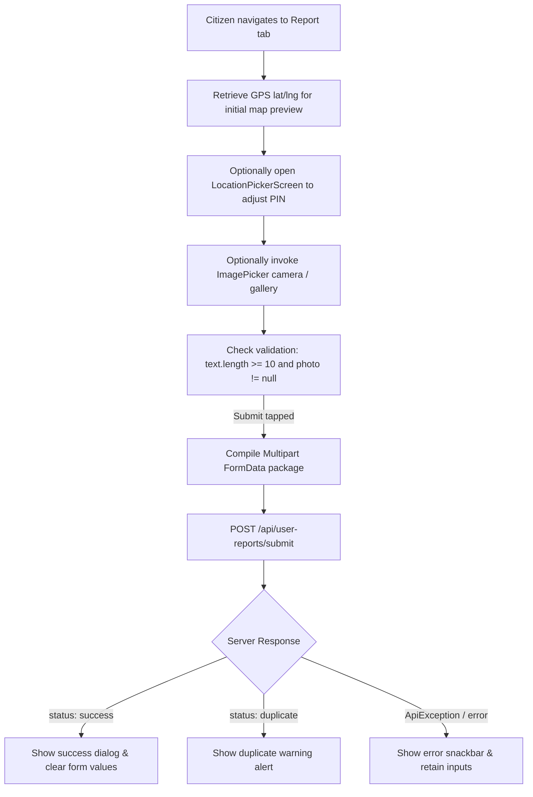

# BaKhabar Alerts — Incident Workflows & Lifecycles

This document describes the end-to-end data lifecycle of a crisis alert, including client-side filtering, geospatial focus transitions, and report submission flows.

---

## 🔁 Incident Data Lifecycle

---

## 🗺️ Geospatial Focus Transition (List ➔ Map)

When a citizen views an incident in the feed list and taps the **Open on Map** action, the following transition occurs:

---

## ✍️ Citizen Report Submission Pipeline

Reporting a hazard from the field involves file capture, location picking, and server-side deduplication validation:

